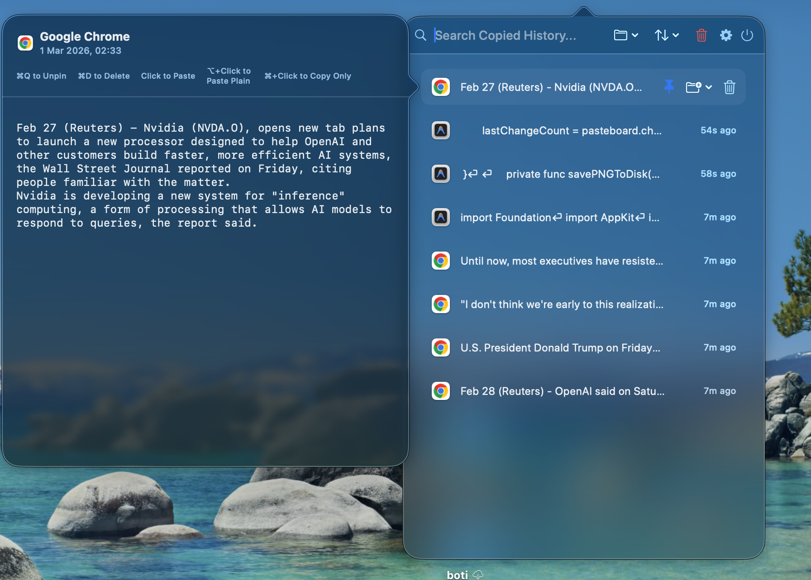
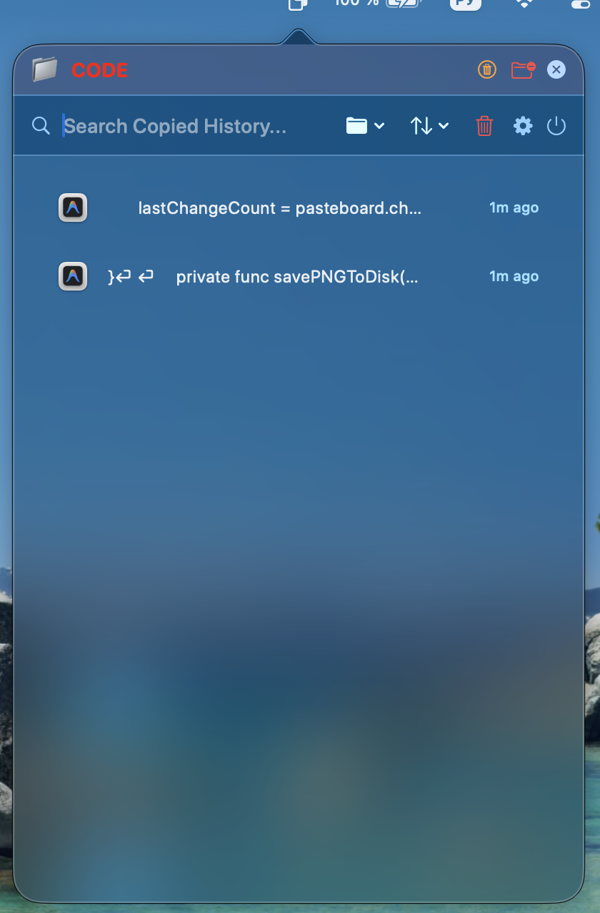
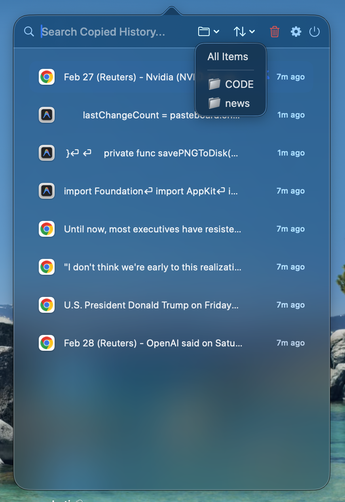

# SkyPaste 📋

SkyPaste is a lightweight, efficient clipboard manager for macOS, designed with a focus on speed and simplicity. I created this for myself because I wanted something that just works without the bloat.

## Features

- **Blazingly Fast**: Lightweight and optimized for performance.
- **Smart Folders**: Organize your snippets with custom emojis and colors.
- **Image Support**: Capture and store images directly from your clipboard with previews.
- **Global Shortcuts**: Highly customizable hotkeys for every action.
- **Privacy First**: All data stays on your machine. No cloud, no tracking.
- **Clean UI**: A native macOS interface that stays out of your way.

## Installation

1. Download the latest build.
2. Drag `SkyPaste.app` to your `Applications` folder.
3. Grant Accessibility permissions in System Settings (required for auto-paste).

## Settings

## Support & Feedback

If you enjoy using SkyPaste, please consider:
- 🌟 Giving the project a star on GitHub.
- 🎮 Sending a gift from my [Steam Wishlist](https://steamcommunity.com/id/sasaiber/).

