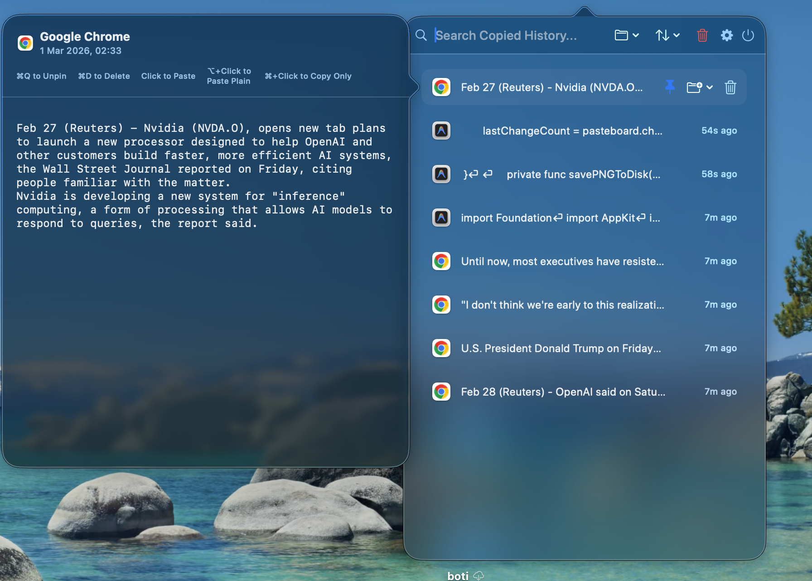
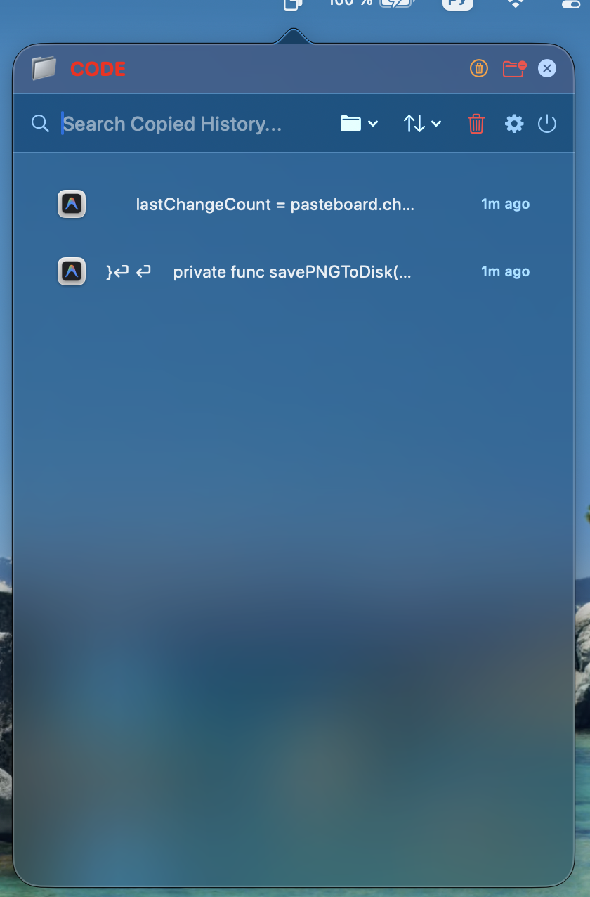
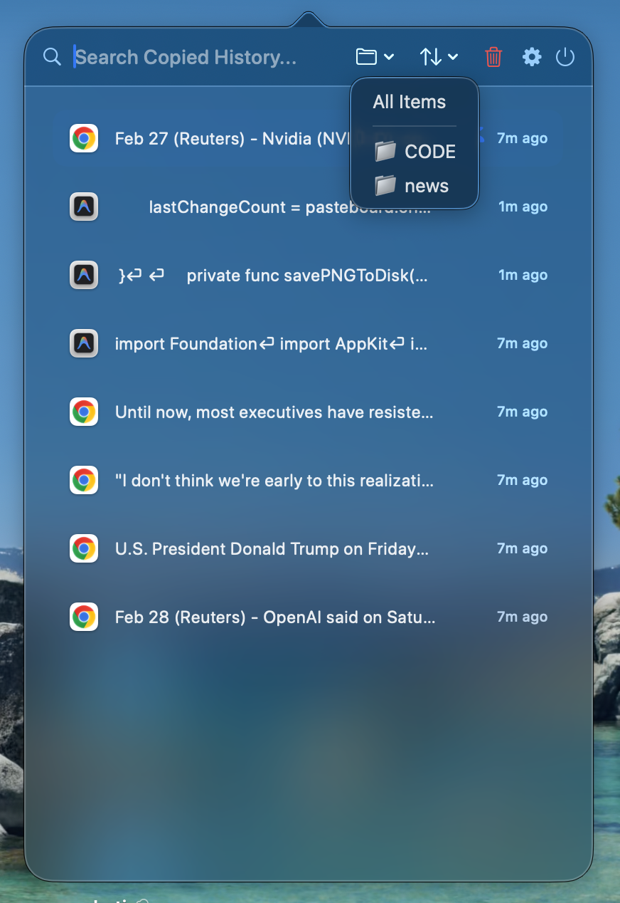

# SkyPaste 📋

SkyPaste is a lightweight, efficient clipboard manager for macOS, designed with a focus on speed and simplicity. I created this for myself because I wanted something that just works without the bloat.

## Features

- **Blazingly Fast**: Lightweight and optimized for performance.
- **Smart Folders**: Organize your snippets with custom emojis and colors.
- **Image Support**: Capture and store images directly from your clipboard with previews.
- **Global Shortcuts**: Highly customizable hotkeys for every action.
- **Privacy First**: All data stays on your machine. No cloud, no tracking.
- **Clean UI**: A native macOS interface that stays out of your way.

## Installation

1. Download the latest build.
2. Drag `SkyPaste.app` to your `Applications` folder.
3. Grant Accessibility permissions in System Settings (required for auto-paste).

## Settings

## Keyboard Shortcuts

### Global Shortcuts

| Action | Default Shortcut | Configurable |
|--------|-----------------|--------------|
| Show SkyPaste | ⌘S | ✅ |
| Paste Plain Text | ⌘⇧⌥V | ✅ |

### In-App Shortcuts (when SkyPaste window is open)

| Action | Default Shortcut | Configurable |
|--------|-----------------|--------------|
| Quick Pin | ⌘P | ✅ |
| Quick Delete | ⌘⌫ | ✅ |
| Create Folder | ⌘F | ✅ |
| View in Finder | ⇧⌘F | ✅ |
| Library (All Folders) | ⌥A | ✅ |

### Preview Panel Shortcuts (hover over an item to see preview)

| Action | Shortcut |
|--------|----------|
| Pin / Unpin | ⌘P (configurable) |
| Delete | ⌘⌫ (configurable) |
| View in Finder | ⇧⌘F (configurable) |
| Click to Paste | Left Click |
| Paste Plain Text | ⌥+Click |
| Select single file | ⌘+Click |
| Toggle select files | ⇧+Click (add/remove) |
| Context menu (copy, pin, delete) | Right Click |

> All in-app shortcuts can be customized in **Settings → Shortcuts** tab.

## Privacy

Your privacy is paramount. Read our [Privacy Policy](PRIVACY_POLICY.md) to learn how SkyPaste operates:
- ✅ All data stays on your machine
- ✅ Nothing is sent to external servers
- ✅ No tracking, no analytics, no cloud
- ✅ Complete local control

## Support & Feedback

If you enjoy using SkyPaste, please consider:
- 🌟 Giving the project a star on GitHub.
- 🎮 Sending a gift from my [Steam Wishlist](https://steamcommunity.com/id/sasaiber/).

